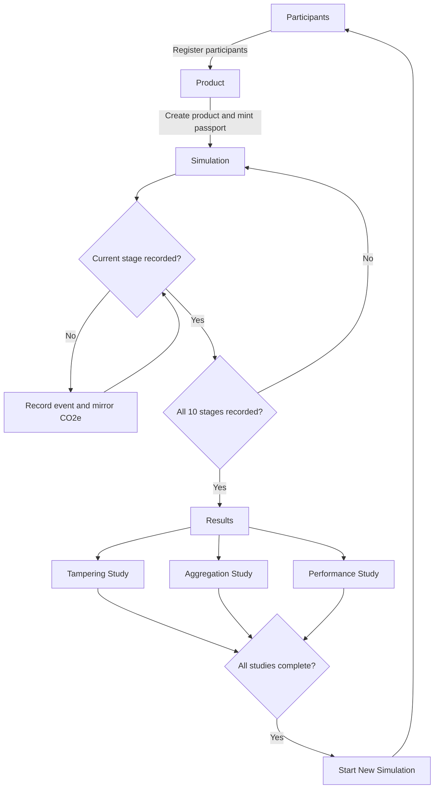

# Carbon MVP — Permissioned Blockchain Prototype for Granular Product Carbon Tracking

A proof-of-concept system built for the dissertation *Blockchain Enabled Granular
Carbon Tracking: Designing, Building and Evaluating an Assurance Architecture for
Product-Level Scope 3 Reporting Across Product Life Cycle* (Ong). It demonstrates
that granular, per-stage product carbon events can be recorded, verified,
aggregated, and audited on a permissioned blockchain in a way that is more
tamper-evident than a spreadsheet or a centralised database.

The full design rationale is Chapter 4 of the dissertation; the evaluation
protocols are Appendix D.

## What it does

The prototype follows **one laptop** through ten lifecycle stages — aluminium
smelting, PCB, battery, screen, assembly, packaging, shipping, use phase,
repair, recycling — and records each stage's CO₂e emissions as an event on a
private **Hyperledger Besu** network (QBFT consensus, 4 validators + 1
regulator node) running locally in Docker. Smart contracts enforce who may
write what, chain each event to the previous one, aggregate stage totals into
a product footprint, and allow governed (logged, append-only) corrections
instead of silent edits.

It is a **research demonstrator**, not a production system. Actors and data
are simulated; emission factors are parameterised from published sources
(IAI, IEA, DESNZ, EPA WARM, Peiseler et al. 2024, Lövehagen et al. 2023 —
full citations in Appendix E and simulation/synthetic/factors-table.json).

## Layout

| Folder | Purpose |
|---|---|
| `network/` | Besu private network: Docker Compose file, genesis block, node keys |
| `contracts/` | The seven Solidity smart contracts |
| `test/` | Automated tests for the contracts |
| `simulation/` | Supply-chain simulation: actors, ten lifecycle stages, emission factors |
| `audit/` | Auditor tools: provenance reconstruction and integrity verification |
| `baselines/` | Spreadsheet and SQLite comparators for the tamper-evidence study |
| `evaluation/` | Studies A (tampering), B (aggregation), C (performance) and their results |
| `docs/` | Reserved; architecture documentation lives in Chapter 4 of the dissertation |

## Toolchain

- **Node.js + TypeScript** — everything that isn't a smart contract
- **Hardhat** — compile, test, and deploy the Solidity contracts
- **OpenZeppelin Contracts** — audited building blocks (ERC-1155, AccessControl, UUPS proxy)
- **Hyperledger Besu 26.7.1** (via Docker, image pinned) — the permissioned EVM network
- **Custom open-loop benchmark driver** — throughput, latency, block-time and finality measurement for Study C. Hyperledger Caliper could not be used: its current release has withdrawn EVM support and its last EVM-capable release fails to install on this environment (see dissertation Appendix D.3). Toolchain versions as evaluated: Besu 26.7.1, Node 24.19, Docker Desktop 29.6.2, Solidity 0.8.28, Slither 0.11.6.

## Getting started

```
npm install          # fetch project libraries (first time only)
npx hardhat compile  # compile the smart contracts
npx hardhat test     # run the contract tests
```

## Running the blockchain network

**Prerequisite:** Docker Desktop must be running (whale icon in the system
tray). Then, from the project folder:

| What | Command |
|---|---|
| Start the network (5 nodes) | `npm run network:up` |
| Check it is healthy | `npm run network:health` |
| Thorough check (sends test transactions) | `npm run network:health:full` |
| Stop the network (chain data is kept) | `npm run network:down` |
| Stop AND erase the chain back to block 0 | `npm run network:reset` |
| Deploy the contracts to the network | `npm run deploy:besu` |
| Run the 10-stage laptop lifecycle simulation | `npm run simulate` |

After a `network:reset`, run `deploy:besu` again before `simulate` (a wiped
chain forgets the contracts). Each `simulate` run tracks a NEW laptop (product
id 1, 2, 3, ...) and writes its passport to `simulation/output/`.

**Data quality:** the emission-factor library of record is
`simulation/synthetic/factors-table.json`. Nine of the ten stage factors are
verified against primary sources (IAI, IEA, DESNZ, EPA WARM, Peiseler et al.,
Lövehagen et al.; citations in the file and in dissertation Appendix E); the
populated-circuit-board factor is a documented derivation composed from two
cited component factors. Activity data is modelled (synthetic) — see
`dissertation-results/synthetic-data-statement.md`: no reported footprint is an
empirical measurement of a real product.

The first start takes ~30 seconds before blocks appear. A healthy network
shows every node with `peers 4/4`, all at the same block number, and the
block number rising — one new block every 2 seconds.

Stopping with `network:down` is like switching off a computer: the ledger
survives and continues where it left off on the next start. `network:reset`
is the nuclear option: it deletes the ledger entirely (useful for starting
an experiment from a clean slate).

## Reproducing everything from scratch

Everything below has been run end-to-end on Windows 11; total time is roughly
an hour, most of it unattended. Commands go in a terminal opened in the
project folder.

**Prerequisites:** [Node.js](https://nodejs.org) 24+, [Docker
Desktop](https://www.docker.com/products/docker-desktop/) (running), and Git.
About 6 GB of RAM free for the 5-node network (12 GB for the optional
7-validator comparison network).

**1. Install project libraries** (once):

```
npm install
```

**2. Contract test suite** (runs on an in-memory chain; no Docker needed):

```
npx hardhat test
```

Expected: 53 passing tests.

**3. Start the permissioned network and verify it** (first start pulls the
Besu image; allow a few minutes):

```
npm run network:up
npm run network:health:full
```

Expected: all 5 nodes at the same rising block height with `peers 4/4`,
validator set of 4, an allow-listed transaction MINED and a stranger's
REJECTED, verdict HEALTHY. (For a pristine chain first run
`npm run network:reset`.)

**4. Deploy contracts, run the lifecycle simulation, replicate baselines,
audit:**

```
npm run deploy:besu
npm run simulate
npm run baselines
npm run audit
```

Expected: a 10-stage product passport (`simulation/output/`), a three-way
PARITY OK across ledger/CSV/SQLite, and an audit verdict PASS with every
hash recomputed and all evidence VERIFIED (`audit/output/`).

**5. Evaluation studies:**

```
npm run study:a
npm run study:b
npm run study:c:bench4
```

For the 7-validator comparison (Study C): stop the main network, build and
start the comparison network, benchmark it, then restore:

```
npm run network:down
npm run study:c:setup7
docker compose -f network/network7/docker-compose.yml up -d
npm run study:c:bench7
docker compose -f network/network7/docker-compose.yml down
npm run network:up
npm run study:c:report
```

Results land in `evaluation/results/` (methods, tables, charts, raw JSON).
Note: `study:c:setup7` regenerates the 7-validator network from fresh keys,
and performance figures are hardware-dependent — an examiner should expect
the same orders of magnitude, not identical numbers.

**6. Dissertation-ready tables:**

```
npm run results:build
```

Curated tables, charts, and the plain-English summary land in
`dissertation-results/`.

**Determinism notes.** Contract tests and Studies A/B assertions are
deterministic. Chain data (timestamps, hashes, addresses) differs per
deployment; the *properties* asserted are the reproducible objects. The
committed keys are simulation props enabling exact reproduction; they secure
nothing outside this project.

### Network facts

- Chain ID **2026**; QBFT consensus; 2-second blocks; immediate finality;
  free gas (this is a research network, not a public one).
- Nodes and their RPC ports on localhost: validator1 → 8545,
  validator2 → 8546, validator3 → 8547, validator4 → 8548,
  **regulator (non-voting observer) → 8549**.
- Only nodes listed in `network/permissions_config.toml` may join; only
  accounts listed there may transact. The 11 simulated participants and
  their keys are in `network/accounts.json`.
- **The keys in this repository are simulation props.** They control no
  real assets anywhere. They are committed on purpose so the artefact is
  reproducible; never reuse them outside this project.
- Note: Besu itself rewrites `permissions_config.toml` into compact form
  at startup (it persists allowlist state back to the file) — do not be
  surprised when comments added to that file disappear.

## Frontend

The frontend is an evidence-oriented React application that guides an operator
through the complete lifecycle of a product carbon passport. It registers and
authorises supply-chain participants, creates a product passport, records ten
lifecycle events, and runs Tampering, Aggregation, and Performance studies.

### User flow



1. Register participants and authorise their lifecycle stages.
2. Register the product and mint its passport.
3. Record each lifecycle event with activity, factor, methodology, schema, and
   evidence hash.
4. Complete all ten stages to activate Results.
5. Run the three evaluation studies.
6. Clear browser state after all studies complete to start again.

### Pages

The application has four routes: `/actors`, `/product`, `/simulation`, and
`/results`. The actors page registers participants; Product creates and mints
the passport; Simulation records sequential events; and Results runs the three
evaluation studies. Product, Simulation, and Results are enabled progressively
from the stored workflow state.

### Components

Workflow components are grouped under `frontend/src/components`:

- `participants/Participants.tsx` and `registerParticipants.ts` register and
  authorise participants.
- `product/Product.tsx` and `registerProduct.ts` register the product and mint
  its passport.
- `simulation/Simulation.tsx` and `registerEmissionEvent.ts` record events.
- `result/Results.tsx` and the three `study*.ts` files run evaluations.

Shared components are under `frontend/src/shared`: `Button.tsx` provides the
reusable button, `Stage.tsx` renders the detailed event card, and `StageCard.tsx`
renders a compact lifecycle marker.

### Hooks, Services, and Shared Components

`hooks/useContracts.ts` creates ethers contract instances using the configured
Besu provider, deployed addresses, ABIs, and optional signers. Services provide
network configuration, contract addresses, emission-factor data, actor names,
signer wallets, and shared lifecycle types.

### Data

Lifecycle data supplies participant permissions, product configuration, event
activity, emission factors, reporting sources, and methodologies. Event
registration uses x1000 fixed-point values and signed CO2e grams. Study C loads
the committed four-validator and seven-validator benchmark JSON files.

### Studies

- Tampering checks value lowering, event deletion, and back-dating scenarios.
- Aggregation checks totals, stage subtotals, hashes, completeness, and fault
  cases.
- Performance compares validator benchmark results for throughput and latency.

Study states and results persist in localStorage. After all three studies are
complete, the sidebar exposes a reset control that clears localStorage and
starts a new simulation.

### Structure

```text
frontend/
└── src/
    ├── App.tsx
    ├── main.tsx
    ├── components/
    │   ├── participants/
    │   ├── product/
    │   ├── result/
    │   └── simulation/
    ├── hooks/
    ├── services/
    └── shared/
```

### Implementation

`App.tsx` owns routes, navigation gates, network status, completion status, and
the reset action. `main.tsx` mounts the application inside `BrowserRouter` and
`React.StrictMode`. The lifecycle proceeds through participant registration,
product registration, ten sequential event registrations, Results activation,
the three evaluations, and the optional reset to a new simulation.

### LocalStorage

- `registered-actors-cache` — registered participant details.
- `registered-product-cache` — product ID, description, and OEM address.
- `registered-emission-events-cache` — recorded stage IDs, CO2e values, and
  event hashes.
- `tampering-study-result` — Tampering Study result object.
- `aggregation-study-result` — Aggregation Study result object.
- `performance-study-result` — Performance Study result object.
- `evaluation-studies-complete` — flag indicating all three studies completed.
