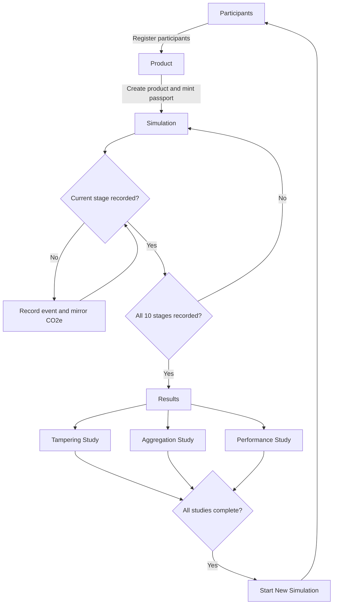

# React Frontend

This folder documents the implemented React frontend. The sections below
render the content of the corresponding documentation files directly instead
of linking to them.

## Overview

The frontend is an evidence-oriented React application that guides an operator
through the complete lifecycle of a product carbon passport. It registers and
authorises supply-chain participants, creates a product passport, records ten
lifecycle events, and runs Tampering, Aggregation, and Performance studies.

During simulation, one lifecycle stage is shown at a time in a horizontal
Stage-card slider. Each stage includes its activity, emission factor, reporting
schema, responsible participant, calculated CO2e, and previous-event link. The
event registry stores the event and evidence hash, while the Carbon Token
contract mirrors positive emissions or negative credits. The next stage is
gated until the current event is confirmed.

### User flow



1. Register participants and authorise their lifecycle stages.
2. Register the product and mint its passport.
3. Record each lifecycle event with activity, factor, methodology, schema, and
   evidence hash.
4. Complete all ten stages to activate Results.
5. Run the three evaluation studies.
6. Clear browser state after all studies complete to start again.

## Pages

The frontend has four routes: `/actors`, `/product`, `/simulation`, and
`/results`. Navigation is gated by localStorage state.

### `/actors`

`components/participants/Participants.tsx` renders the participant workflow
and uses `registerParticipants.ts` to register and authorise participants. It
is the only enabled workflow tab at the start of a simulation.

### `/product`

`Product.tsx` displays the configured product. `registerProduct.ts` creates the
product and mints its passport on-chain.

### `/simulation`

`Simulation.tsx` displays one `Stage` card at a time. Events are recorded
through `EmissionEventRegistry`, and positive or negative CO2e is mirrored in
`CarbonToken`. The next arrow is disabled until the current event is confirmed.

### `/results`

`Results.tsx` contains Tampering, Aggregation, and Performance tabs. Each study
has idle, running, and complete states; results persist in localStorage and are
shown in the right-hand summary card.

## Components

### Application shell

- `App.tsx` renders the header, network indicator, gated sidebar navigation,
  route guards, and reset button.
- `Button.tsx` provides primary and secondary button variants.

### Workflow components

- `Participants.tsx` registers and restores participant state.
- `Product.tsx` displays product metadata and registration state.
- `Simulation.tsx` manages the stage slider, event recording, cache, totals,
  and threshold reporting.
- `Stage.tsx` renders one event card and its record button.
- `Results.tsx` provides the three evaluation tabs and summaries.
- `studyTampering.ts`, `studyAggregation.ts`, and `studyPerformance.ts` run or
  load the browser-compatible evaluation studies.
- `StageCard.tsx` is a compact lifecycle marker; simulation recording uses
  `Stage.tsx`.

## Hooks, Services, and Shared Components

### Hooks

`hooks/useContracts.ts` provides ethers contract factories for the participant
registry, event registry, carbon token, aggregation, ontology, multisig, and
governance contracts. It uses the configured local Besu provider and deployed
contract addresses.

### Services

- `networkConfig.ts` provides the RPC URL and chain ID.
- `contractAddresses.ts` provides deployed contract addresses.
- `emissionFactors.ts` provides lifecycle factor data.
- `getActors.ts` provides participant names and roles.
- `getSigner.ts` provides role-based wallets.
- `getTypes.ts` provides shared lifecycle stage types.

### Shared components

- `Button.tsx` provides the reusable button element.
- `Stage.tsx` renders a simulation event card.
- `StageCard.tsx` renders a compact lifecycle stage marker.

## Data

### Participant registration

Participant records contain a numeric ID, organisation name, role, wallet
address, and assigned lifecycle stage. The participant registry stores the
registration and stage authorisations.

### Product registration

The product record contains the product ID, description, and OEM/passport-holder
address. Product registration creates the product and mints its passport.

### Event registration

Each stage provides its ID, name, actor role, activity value and unit, emission
factor, source, and methodology. The frontend scales numeric values by 1000 for
the contract, hashes evidence, records the event, and mirrors positive or
negative CO2e through the carbon-token contract.

### Evaluation data

- **Tampering:** checks cached events against integrity-threat scenarios.
- **Aggregation:** checks totals, per-stage agreement, hashes, traceability,
  completeness, and fault cases.
- **Performance:** compares committed four-validator and seven-validator
  benchmark JSON files using throughput and latency metrics.

## Studies

- `studyTampering.ts` runs six browser-safe tampering scenarios and reports
  detected and undetected outcomes.
- `studyAggregation.ts` checks totals, event hashes, traceability, completeness,
  and altered or missing event cases.
- `studyPerformance.ts` loads benchmark files and displays TPS in `tx/s`,
  average latency in `ms`, and latency percentage change.

Each study exposes idle, running, and completed labels, and persists its result
in localStorage.

## Structure

```text
frontend/
└── src/
    ├── App.tsx
    ├── main.tsx
    ├── components/
    │   ├── participants/
    │   ├── product/
    │   ├── result/
    │   └── simulation/
    ├── hooks/
    ├── services/
    └── shared/
```

## Implementation

`App.tsx` is the application shell and route coordinator. It renders
navigation, defines the four routes, applies localStorage gates, updates the
simulation status, and exposes the reset workflow.

`main.tsx` imports global styles, provides `BrowserRouter`, and mounts the
application with `createRoot` and `React.StrictMode`.

The components folder is organised into participants, product, simulation, and
result subfolders. Registration helpers submit participant, product, and event
transactions, while result helpers run the three browser-compatible studies.

The lifecycle completes through participant registration, product registration,
ten sequential event registrations, Results activation, the three evaluations,
and the optional reset to a new simulation.

## LocalStorage

- `registered-actors-cache` — registered participant details.
- `registered-product-cache` — product ID, description, and OEM address.
- `registered-emission-events-cache` — recorded stage IDs, CO2e values, and
  event hashes.
- `tampering-study-result` — Tampering Study result object.
- `aggregation-study-result` — Aggregation Study result object.
- `performance-study-result` — Performance Study result object.
- `evaluation-studies-complete` — flag indicating all three studies completed.
