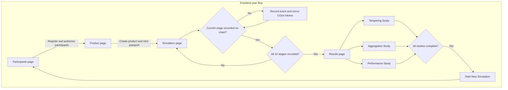

# Frontend Overview

The frontend is an evidence-oriented React application that guides an operator
through the complete lifecycle of a product carbon passport. It begins by
registering the supply-chain participants and authorising the lifecycle stages
they are allowed to report. It then creates a product record and mints its
passport before allowing lifecycle events to be recorded.

During simulation, the interface presents one lifecycle stage at a time in a
horizontal Stage-card slider. Each stage displays its activity, emission factor,
reporting schema, responsible participant, calculated CO2e, and relationship to
the previous event. The authorised participant signs the event transaction, the
Emission Event Registry stores the event and its evidence hash, and the Carbon
Token contract mirrors positive emissions or negative credits. The next stage
is gated until the current event has been confirmed.

After all ten events are recorded, the Results page becomes available. It
provides three evaluation tabs: a Tampering Study for integrity threats, an
Aggregation Study for totals and fault checks, and a Performance Study for
validator throughput and latency comparisons. Participant, product, event, and
study results are persisted in localStorage so the workflow survives page
navigation and refreshes. Once all studies are complete, the operator can
clear the stored state and start a new simulation.

## User flow

### Step 1 — Register participants

The operator registers the configured supply-chain participants and authorises
the lifecycle stages each participant can report. Product navigation becomes
available after participant registration is confirmed.

### Step 2 — Register the product

The operator creates the product and mints its passport. Simulation navigation
becomes available only after both participant and product registration are
ready.

### Step 3 — Record lifecycle events

The Simulation page presents one Stage card at a time. The responsible actor
records the event on-chain, including activity, emission factor, methodology,
schema, and evidence hash. Positive emissions are minted as carbon tokens and
negative emissions burn carbon tokens.

### Step 4 — Complete all stages

The next Stage card remains locked until the current event transaction is
confirmed. After the tenth event, the Results page is activated and the sidebar
marks the simulation as completed.

### Step 5 — Run evaluations

The operator runs the Tampering, Aggregation, and Performance studies. Each
study reports its own status and results in the Results page.

### Step 6 — Start a new simulation

After all three studies complete, the sidebar exposes `Start New Simulation`.
Selecting it clears the browser state and returns the operator to the
Participants page.
